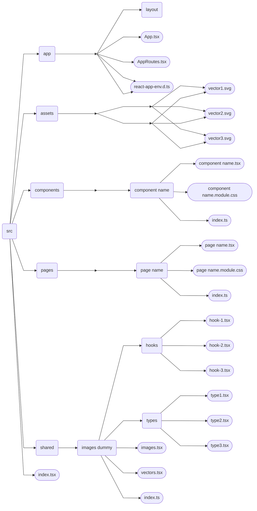

# Unmanned - Drone themed shop!

-----

# Navigation

- [Team](#team-)
- [Architecture](#code-architecture-)
- [Structure](#project-structure-)
- [Pages](#)
- [Additional: Code Style](#code-style-)
- [Additional: More Info](#more-info-)

-----

# Team [↑](#navigation)

- [Tereshonok Maksym](https://github.com/TereshonokMaksim) - Teamlead.
- [Mozgoviy Artem](https://github.com/MozgoviyArtem) - Team Member.
- [Tkachuk Gleb](https://github.com/Gleb-Tkachuk) - Team Member.

-----

# Code architecture [↑](#navigation)

This project has Backend and Frontend as its 2 main parts. They have unique roles and work together, to create an app.
- __[Backend](https://github.com/TereshonokMaksim/Unmanned-Project)__ - Everything that happens on server. Client (user) doesn't directly see what happens here, but it heavily influences how Frontend works.
- __Frontend__ - Everything that happens on client side. Here, client sees and can interact with this site, but it doesn't have heavy logic or databases, so it depends on Backend. 

## Frontend architecture

Frontend architecture is based on 4 layers, each responsible for different functionality. Each layer has different level of importance and, if most important will break, other layers will break as well. In list below, layers are presented in decreasing list of importance (first layer is most important)

- __shared__ - First layer, here, functions, elements, types, etc are created. Functions from this layer can be used in many components or pages.\
- __components__ - Second layer, here, components, which can be reused are created (for example, Header of page or product card). In difference to _shared_ layer, components here are more complex, specific and get better styling.\
- __pages__ - Third layer, here, pages are assembled from components, which are usually stored in _components_ layer and some things from _shared_. Styles here are, usually, less complex than in _components_, but much more specific.\  
- __app__ - Fourth and final layer, here, all pages are connected through links in an Application and launching it. It usually contains no styles or components, though it can have things like Layout which are used only in this layer.

---

# Structure [↑](#navigation)

<b>Structure described in text</b>

__shared__\
Contains:
- images.tsx
- vectors.tsx
- types
- hooks

images.tsx and vectors.tsx are made to store all imports to images and vectors from assets in one file, to make code more organized\
types contain files which have types for easier work with them in other parts of this applicatioin\
hooks contain files with custom hooks - additional functions, which are made to simplify work of next layer - __components__

__assets__\
Contains:
- images
- vectors

images - Folder with all static images which are used in the application\
vectors - Folder with all static vectors (usually .svg files) for the application

__components__\
Contains:\
Folders (with name of _component name_) with components, each of them has:
- _component name_.tsx
- _component name_.module.css

_component name_.tsx - File with component code - contains logic and HTML of this element. Can use other components to decrease amount of code.\
_component name_.module.css - File with component styles. Used only inside of this component.\
Note, that this component can potentially have more components inside of it, if they are used only within it.\
*_component name_ is a general reference to component, which is created in this folder

__pages__\
Contains:\
Folders (with name of _page name_) with pages, each of them has:
- _page name_.tsx
- _page name_.module.css

_page name_.tsx - File with component code - contains logic and HTML of this element. Can use other components to decrease amount of code.\
_page name_.module.css - File with component styles. Used only inside of this component.\
*_page name_ is a general reference to page, which is created in this folder

__app__\
Contains:
- App.tsx
- AppRoutes.tsx
- react-app-env.d.ts
- layout

App.tsx - In this file application is finally assembled and created
AppRoutes.tsx - File with all pages connected through links, which user can navigate through
react-app-env.d.ts - Here, import settings are used from other react declaration files. Required for correct work with .css and image files
layout - Folder with component of Layout - usually just merge of several other components for easier use

*_Note, that many of these folders contain file called index.ts - It is Barrel file or Public API, required only for easier imports and readability_

<b>Structure described as diagram</b>

# Getting Started with Create React App

This project was bootstrapped with [Create React App](https://github.com/facebook/create-react-app).

## Available Scripts

In the project directory, you can run:

### `npm start`

Runs the app in the development mode.\
Open [http://localhost:3000](http://localhost:3000) to view it in the browser.

The page will reload if you make edits.\
You will also see any lint errors in the console.

### `npm test`

Launches the test runner in the interactive watch mode.\
See the section about [running tests](https://facebook.github.io/create-react-app/docs/running-tests) for more information.

### `npm run build`

Builds the app for production to the `build` folder.\
It correctly bundles React in production mode and optimizes the build for the best performance.

The build is minified and the filenames include the hashes.\
Your app is ready to be deployed!

See the section about [deployment](https://facebook.github.io/create-react-app/docs/deployment) for more information.

### `npm run eject`

**Note: this is a one-way operation. Once you `eject`, you can’t go back!**

If you aren’t satisfied with the build tool and configuration choices, you can `eject` at any time. This command will remove the single build dependency from your project.

Instead, it will copy all the configuration files and the transitive dependencies (webpack, Babel, ESLint, etc) right into your project so you have full control over them. All of the commands except `eject` will still work, but they will point to the copied scripts so you can tweak them. At this point you’re on your own.

You don’t have to ever use `eject`. The curated feature set is suitable for small and middle deployments, and you shouldn’t feel obligated to use this feature. However we understand that this tool wouldn’t be useful if you couldn’t customize it when you are ready for it.

## Learn More

You can learn more in the [Create React App documentation](https://facebook.github.io/create-react-app/docs/getting-started).

To learn React, check out the [React documentation](https://reactjs.org/).
