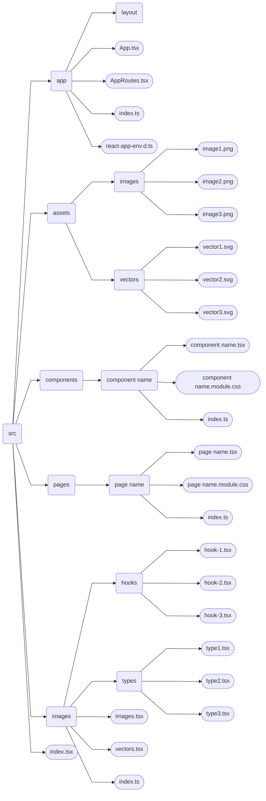

# Unmanned - Drone themed shop!

-----

# Navigation

- [Team](#team-)
- [Architecture](#code-architecture-)
- [Structure](#project-structure-)
- [Pages](#pages-)
- [Additional: Code Style](#code-style-)
- [Additional: Commands](#commands-)

-----

# Team [↑](#navigation)

- [Tereshonok Maksym](https://github.com/TereshonokMaksim) - Teamlead.
- [Mozgoviy Artem](https://github.com/MozgoviyArtem) - Team Member.
- [Tkachuk Gleb](https://github.com/Gleb-Tkachuk) - Team Member.

-----

# Code architecture [↑](#navigation)

This project has Backend and Frontend as its 2 main parts. They have unique roles and work together, to create an app.
- __[Backend](https://github.com/TereshonokMaksim/Unmanned-Project)__ - Everything that happens on server. Client (user) doesn't directly see what happens here, but it heavily influences how Frontend works.
- __Frontend__ - Everything that happens on client side. Here, client sees and can interact with this site, but it doesn't have heavy logic or databases, so it depends on Backend. 

## Frontend architecture

Frontend architecture is based on 4 layers, each responsible for different functionality. Each layer has different level of importance and, if most important will break, other layers will break as well. In list below, layers are presented in decreasing list of importance (first layer is most important)

- __shared__ - First layer, here, functions, elements, types, etc are created. Functions from this layer can be used in many components or pages.\
- __components__ - Second layer, here, components, which can be reused are created (for example, Header of page or product card). In difference to _shared_ layer, components here are more complex, specific and get better styling.\
- __pages__ - Third layer, here, pages are assembled from components, which are usually stored in _components_ layer and some things from _shared_. Styles here are, usually, less complex than in _components_, but much more specific.\  
- __app__ - Fourth and final layer, here, all pages are connected through links in an Application and launching it. It usually contains no styles or components, though it can have things like Layout which are used only in this layer.

---

# Structure [↑](#navigation)

<b>Structure described in text</b>

__shared__\
Contains:
- images.tsx
- vectors.tsx
- types
- hooks

images.tsx and vectors.tsx are made to store all imports to images and vectors from assets in one file, to make code more organized\
types contain files which have types for easier work with them in other parts of this applicatioin\
hooks contain files with custom hooks - additional functions, which are made to simplify work of next layer - __components__

__assets__\
Contains:
- images
- vectors

images - Folder with all static images which are used in the application\
vectors - Folder with all static vectors (usually .svg files) for the application

__components__\
Contains:\
Folders (with name of _component name_) with components, each of them has:
- _component name_.tsx
- _component name_.module.css

_component name_.tsx - File with component code - contains logic and HTML of this element. Can use other components to decrease amount of code.\
_component name_.module.css - File with component styles. Used only inside of this component.\
Note, that this component can potentially have more components inside of it, if they are used only within it.\
*_component name_ is a general reference to component, which is created in this folder

__pages__\
Contains:\
Folders (with name of _page name_) with pages, each of them has:
- _page name_.tsx
- _page name_.module.css

_page name_.tsx - File with component code - contains logic and HTML of this element. Can use other components to decrease amount of code.\
_page name_.module.css - File with component styles. Used only inside of this component.\
*_page name_ is a general reference to page, which is created in this folder

__app__\
Contains:
- App.tsx
- AppRoutes.tsx
- react-app-env.d.ts
- layout

App.tsx - In this file application is finally assembled and created
AppRoutes.tsx - File with all pages connected through links, which user can navigate through
react-app-env.d.ts - Here, import settings are used from other react declaration files. Required for correct work with .css and image files
layout - Folder with component of Layout - usually just merge of several other components for easier use

*_Note, that many of these folders contain file called index.ts - It is Barrel file or Public API, required only for easier imports and readability_

<b>Structure described as diagram</b>

# Pages [↑](#navigation)

__Home Page__
- This page is a landing page
- It has basic information about site and about us
- It has authorization, registration and Password Recovery features
- Has usual Layout

__Catalog Page__
- This page is accessible through navigation bar on header
- It shows all products, their basic information by pages
- It features product filtering by categories  
- Has usual Layout

__Product Page__
- This page is accessible through Catalog Page when clicking on specific product
- It shows detailed information about product
- It has lots of rich text elements and images
- Has usual Layout

__Contact Page__
- This page is accessible through navigation bar on header
- It shows contacts to management
- It features mail sending to contact management right on the place
- Has usual Layout

__About Page__
- This page is accessible through navigation bar on header
- It shows more information about our company and same things
- It is pretty rich in static text and images
- Has usual Layout

__Order Page__
- This page is accessible through navigation bar on header
- It shows all products in cart
- It allows to confirm order, payment and to select destination for it
- Has special Order Layout

__Order Successfull Page__
- This page is sub page of Order page and accessible through it
- It simply shows that order is accepted and will soon be processed
- It allows to go back to home page
- Has special Order Layout

__Contacts Data Page__
- This page is accessible through navigation bar on header
- It shows all personal data, which you entered on this site
- It also allows to change personal data
- Has usual Layout

__My Orders Page__
- This page is accessible through contacts page
- It shows list of your orders which are already confirmed
- It allows to see detailed data about any of your orders
- Has usual Layout

__Addresses Page__
- This page is accessible through contacts page
- This page allows you to see all of your addresses/destinations and detailed data about them
- It allows to edit any of your addresses/destinations
- Has usual Layout 

# Additional [↑](#navigation)
## Code Style [↑](#navigation)

Code, written in this project has basic code styling, such as:

- 4 spaces per one tabulation
- Creating empty line between large functions
- Splitting code into different modules
- Readable and easily-understandable variable and function names

All of the above is required for better readability and code management\
Also, some of principes are followed to decrease code complexity:
-__DRY__ - If 2 parts of code seem to be very similar, then they both just should use reference to 1 function/component, reducing amount of code 
-__Less Nesting__ - If else statement is unnecessary (like return in if statement can remove else) then, the else should not be written so less nests will be present in the code

## Commands [↑](#navigation)

In the project, there are several commands avalaible for use:

### `npm start`

Runs the app in the development mode.\
Open [http://localhost:3000](http://localhost:3000) to view it in the browser.

### `npm test`

Launches the test runner in the interactive watch mode.

### `npm run build`

Builds the app for production to the `build` folder.\
It correctly bundles React in production mode and optimizes the build for the best performance.

The build is minified and the filenames include the hashes.\
Your app is ready to be deployed!

### `npm run eject`

**Note: this is a one-way operation. Once you `eject`, you can’t go back!**

If you aren’t satisfied with the build tool and configuration choices, you can `eject` at any time. This command will remove the single build dependency from your project.
